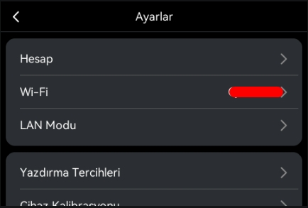
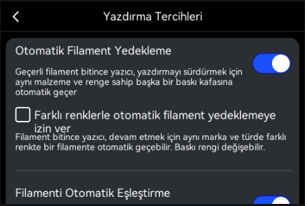
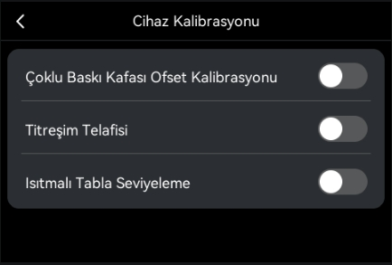
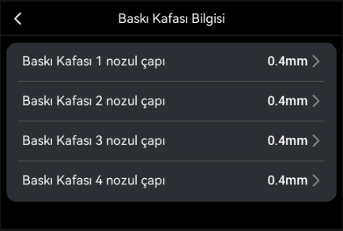
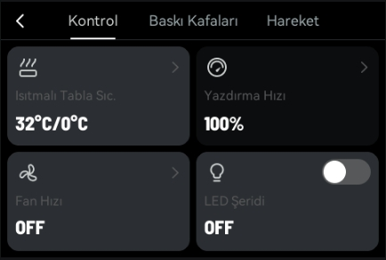
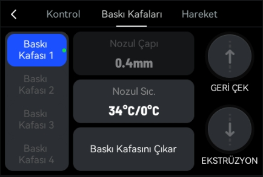
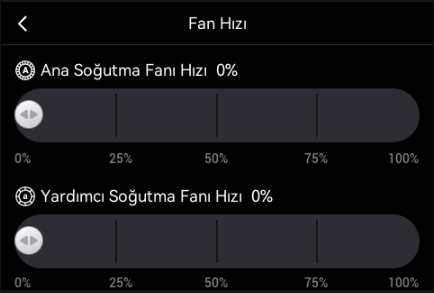
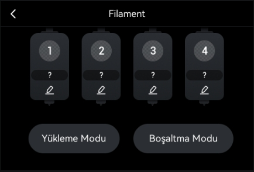

# Snapmaker U1 Türkçe Firmware

Snapmaker U1 dokunmatik ekranına Türkçe dil desteği ekleyen bağımsız bir topluluk projesidir. Türkçe, mevcut dillerden birinin yerine geçirilmez; arayüze ayrı bir `tr-TR` seçeneği olarak eklenir.

> [!IMPORTANT]
> Bu proje **resmî değildir**; Snapmaker tarafından geliştirilmemiş, desteklenmemiş veya onaylanmamıştır. Tamamen ücretsiz ve kâr amacı gütmeyen bir çalışmadır. Firmware yüklemek her zaman risk taşır. İndirdiğiniz dosyanın cihaz, kanal, sürüm ve SHA-256 değerini doğrulamadan yükleme yapmayın.

## Ekran görüntüleri

<table>
  <tr>
    <td align="center"> <strong>Ana ekran</strong></td>
    <td align="center"> <strong>Ayarlar</strong></td>
    <td align="center"> <strong>Yazdırma tercihleri</strong></td>
  </tr>
  <tr>
    <td align="center"> <strong>Cihaz kalibrasyonu</strong></td>
    <td align="center"> <strong>Baskı kafası bilgisi</strong></td>
    <td align="center"> <strong>Kontrol paneli</strong></td>
  </tr>
  <tr>
    <td align="center"> <strong>Baskı kafaları</strong></td>
    <td align="center"> <strong>Fan hızı</strong></td>
    <td align="center"> <strong>Filament</strong></td>
  </tr>
</table>

Görüntüler Extended 1.5.2 Türkçe sürümündendir; diğer taban sürümlerde menü içeriği farklı olabilir.

## İndirme

Hazır paketler ve her paketin tam SHA-256 değeri [GitHub Releases](../../releases) sayfasında yayımlanır.

Desteklenen kanallar birbirinden ayrıdır:

| Kanal | Taban sürüm | Kaynak paket kimliği |
| --- | --- | --- |
| Snapmaker Stock | 1.6.0.267 | `U1_1.6.0.267_20260815150420_upgrade.bin` |
| Extended | 1.5.2-paxx12-21 | İlgili Extended 1.5.2-paxx12-21 paketi |
| Extended | 1.4.1-paxx12-20 | `U1_extended_1.4.1-paxx12-20_upgrade.bin` |

Stock ve Extended paketleri birbiriyle değiştirilebilir dil paketleri değildir. Kullandığınız kanal ve taban sürüm için hazırlanmış release dosyasını seçin. Fiziksel yazıcıda flash/açılış testi yapılıp yapılmadığını ilgili release notundan kontrol edin.

## Güvenli kurulum özeti

1. Doğru kanal ve taban sürüme ait `.bin` dosyasını [Releases](../../releases) sayfasından indirin.
2. Dosyanın **tam 64 karakterlik SHA-256** değerini release notundaki değerle karşılaştırın. Ayrıntılar: [Doğrulama rehberi](docs/VERIFY.md).
3. Kararlı güç sağlayın, devam eden baskıyı bitirin ve cihaz ayarlarınızı yedekleyin.
4. Paketi FAT32 biçimli bir USB belleğin kök dizinine kopyalayın. Cihazınız FAT32 belleği algılamıyorsa desteklediği durumda exFAT deneyin.
5. Dokunmatik ekrandaki yerel/USB firmware güncelleme akışından dosyayı seçin. Güncelleme sırasında gücü kesmeyin ve USB belleği çıkarmayın.
6. Yeniden başlatmanın ardından dil ayarlarından `Türkçe` seçeneğini etkinleştirin.

Adım adım talimat ve kanal uyarıları için [Kurulum rehberini](docs/INSTALL.md) okuyun.

## Proje kapsamı

- Türkçe arayüz ve hata mesajı çevirileri
- Kaynak/çıktı bütünlüğünü denetleyen doğrulama aracı ve manifestler
- Sürüm bazlı derleme/doğrulama raporları
- Kurulum ve teknik belgeler

Orijinal firmware, ayıklanmış rootfs veya çalışma klasörleri Git geçmişinde tutulmaz. Dağıtıma uygun görülen büyük dosyalar yalnızca release eki olarak sunulur.

## Sorumluluk ve üçüncü taraf hakları

Bu deponun katkı sahiplerinin hak sahibi olduğu özgün çeviri, araç ve belgeleri `GPL-3.0-only` kapsamında lisanslanır. Bu lisans; Snapmaker firmware'ine, Extended Firmware bileşenlerine, ticari markalara veya diğer üçüncü taraf içeriklerine yeni bir lisans vermez. Bu bileşenler kendi telif ve lisans koşullarına tabidir.

Projenin ücretsiz/kâr amacı gütmeyen olması, üçüncü taraf koşullarını ortadan kaldırmaz. Ayrıntılar için [Sorumluluk reddi](DISCLAIMER.md) ve [Üçüncü taraf bildirimleri](THIRD_PARTY_NOTICES.md) belgelerine bakın.

## Sorun bildirimi

Bir sorun bildirirken cihaz modelini, kurulu kanal ve sürümü, kullandığınız release dosyasının adını, hesapladığınız SHA-256 değerini ve mümkünse ekran fotoğrafını ekleyin. Seri numarası, Wi-Fi parolası veya erişim belirteci gibi kişisel bilgileri paylaşmayın.

---

## English summary

This is a free, non-profit and unofficial community localization for the Snapmaker U1 touchscreen. It adds Turkish as a separate `tr-TR` locale without replacing the existing languages.

Download a build only from [GitHub Releases](../../releases), select the exact Stock or Extended base version, and compare the complete SHA-256 value before flashing. Stock and Extended channels are not interchangeable. Check each release note for its physical-device test status and read the [installation](docs/INSTALL.md) and [verification](docs/VERIFY.md) guides.

`GPL-3.0-only` applies only to original material for which this project's contributors hold the rights. Snapmaker firmware, Extended Firmware components, trademarks and all other third-party material remain subject to their respective terms. This project is not affiliated with, endorsed by, or supported by Snapmaker.
