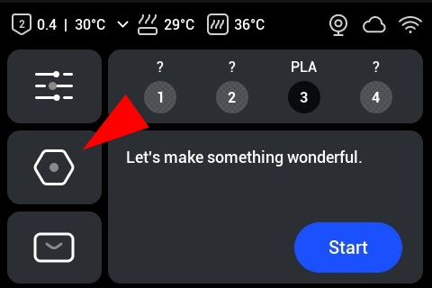
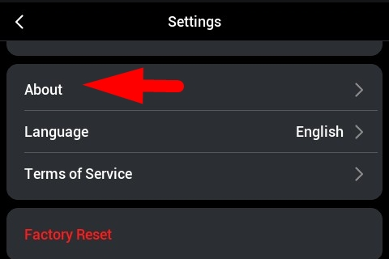
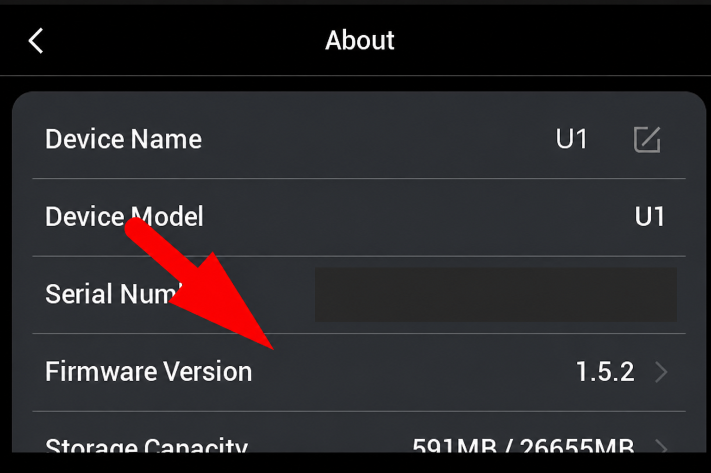
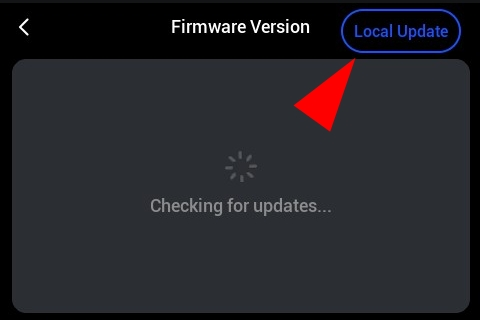
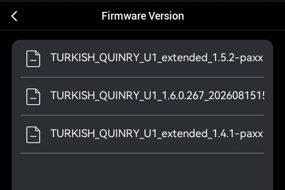
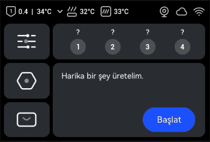

# Snapmaker U1 Türkçe Firmware

Snapmaker U1 dokunmatik ekranına Türkçe dil desteği ekleyen bağımsız bir topluluk projesidir. Türkçe, mevcut dillerden birinin yerine geçirilmez; arayüze ayrı bir `tr-TR` seçeneği olarak eklenir.

> [!IMPORTANT]
> Bu proje **resmî değildir**; Snapmaker tarafından geliştirilmemiş, desteklenmemiş veya onaylanmamıştır. Tamamen ücretsiz ve kâr amacı gütmeyen bir çalışmadır. Firmware yüklemek her zaman risk taşır. İndirdiğiniz dosyanın cihaz, kanal, sürüm ve SHA-256 değerini doğrulamadan yükleme yapmayın.

## Hızlı kurulum

> [!NOTE]
> Türkçe firmware henüz kurulmadığı için aşağıdaki menü adları yazıcıda göreceğiniz İngilizce biçimiyle verilmiştir.

1. Yazıcınızın kanalına ve taban sürümüne uygun `.bin` dosyasını [Releases](../../releases) sayfasından indirin ve release notundaki tam SHA-256 değeriyle doğrulayın.
2. Dosyayı **FAT32** biçimli USB belleğin kök dizinine kopyalayın. Karışıklığı önlemek için bellekte yalnızca yükleyeceğiniz tek firmware `.bin` dosyasını bırakın ve belleği yazıcıya takın.
3. Dokunmatik ekranda **Settings → About** bölümünü açın.
4. **Firmware Version** satırına dokunun.
5. Sağ üstteki **Local Update** seçeneğine girin.
6. USB bellekteki `.bin` dosyasını seçip güncellemeyi onaylayın.
7. Güncelleme tamamlanıp yazıcı yeniden başlayana kadar gücü kesmeyin ve USB belleği çıkarmayın.
8. Yeniden başlatmanın ardından **Settings** içindeki dil ayarını açıp **Türkçe** seçeneğini etkinleştirin.

### Resimli anlatım

<strong>5 adımlı resimli kurulum anlatımını göster</strong>

<table>
  <tr>
    <td width="50%" align="center"> <strong>Görsel 1 — Ana ekranda Settings simgesine dokunun.</strong></td>
    <td width="50%" align="center"> <strong>Görsel 2 — Settings ekranında About satırını seçin.</strong></td>
  </tr>
  <tr>
    <td width="50%" align="center"> <strong>Görsel 3 — Firmware Version satırına dokunun.</strong></td>
    <td width="50%" align="center"> <strong>Görsel 4 — Sağ üstteki Local Update düğmesini seçin.</strong></td>
  </tr>
  <tr>
    <td colspan="2" align="center"> <strong>Görsel 5 — Cihazınıza uygun, SHA-256 değerini doğruladığınız .bin dosyasını seçin.</strong></td>
  </tr>
</table>

> [!WARNING]
> Son görselde birden fazla paket örnek olarak görünmektedir. Gerçek kurulumda Stock ve Extended paketlerini karıştırmayın; USB bellekte yalnızca cihaz kanalınıza ve taban sürümünüze uygun, SHA-256 değerini doğruladığınız tek `.bin` dosyasını bırakın.

Gizlilik amacıyla üçüncü görseldeki cihaz seri numarası kapatılmıştır.

## Ekran görüntüleri

## İndirme

Hazır paketler ve her paketin tam SHA-256 değeri [GitHub Releases](../../releases) sayfasında yayımlanır.

Desteklenen kanallar birbirinden ayrıdır:

| Kanal | Taban sürüm | Kaynak paket kimliği |
| --- | --- | --- |
| Snapmaker Stock | 1.6.0.267 | `TURKISH_QUINRY_U1_1.6.0.267_20260815150420_upgrade.bin` |
| [Extended](https://github.com/paxx12-snapmaker-u1/SnapmakerU1-Extended-Firmware) | 1.5.2-paxx12-21 | `TURKISH_QUINRY_U1_extended_1.5.2-paxx12-21_upgrade.bin` |
| [Extended](https://github.com/paxx12-snapmaker-u1/SnapmakerU1-Extended-Firmware) | 1.4.1-paxx12-20 | `TURKISH_QUINRY_U1_extended_1.4.1-paxx12-20_upgrade.bin` |

Stock ve Extended paketleri birbiriyle değiştirilebilir dil paketleri değildir. Kullandığınız kanal ve taban sürüm için hazırlanmış release dosyasını seçin. Fiziksel yazıcıda flash/açılış testi yapılıp yapılmadığını ilgili release notundan kontrol edin.

## Güvenli kurulum özeti

1. Doğru kanal ve taban sürüme ait `.bin` dosyasını [Releases](../../releases) sayfasından indirin.
2. Dosyanın **tam 64 karakterlik SHA-256** değerini release notundaki değerle karşılaştırın. Ayrıntılar: [Doğrulama rehberi](docs/VERIFY.md).
3. Kararlı güç sağlayın, devam eden baskıyı bitirin ve cihaz ayarlarınızı yedekleyin.
4. Paketi FAT32 biçimli bir USB belleğin kök dizinine kopyalayın. Cihazınız FAT32 belleği algılamıyorsa desteklediği durumda exFAT deneyin.
5. Dokunmatik ekranda **Settings → About → Firmware Version → Local Update** yolunu açıp doğruladığınız dosyayı seçin. Güncelleme sırasında gücü kesmeyin ve USB belleği çıkarmayın.
6. Yeniden başlatmanın ardından **Settings** içindeki dil ayarını açıp `Türkçe` seçeneğini etkinleştirin.

Adım adım talimat ve kanal uyarıları için [Kurulum rehberini](docs/INSTALL.md) okuyun.

## Proje kapsamı

- Türkçe arayüz ve hata mesajı çevirileri
- Kaynak/çıktı bütünlüğünü denetleyen doğrulama aracı ve manifestler
- Sürüm bazlı derleme/doğrulama raporları
- Kurulum ve teknik belgeler

Orijinal firmware, ayıklanmış rootfs veya çalışma klasörleri Git geçmişinde tutulmaz. Dağıtıma uygun görülen büyük dosyalar yalnızca release eki olarak sunulur.

## Teşekkür / Credits

Extended 1.4.1 ve 1.5.2 tabanlarını yayımlayan [paxx12-snapmaker-u1/SnapmakerU1-Extended-Firmware](https://github.com/paxx12-snapmaker-u1/SnapmakerU1-Extended-Firmware) projesine ve katkıda bulunanlara teşekkürler. Bu depo, Extended Firmware üzerindeki özgün geliştirme için sahiplik iddiasında bulunmaz; burada sunulan çalışma Türkçe yerelleştirme, paketleme ve doğrulama katmanıdır.

## Sorumluluk ve üçüncü taraf hakları

Bu deponun katkı sahiplerinin hak sahibi olduğu özgün çeviri, araç ve belgeleri `GPL-3.0-only` kapsamında lisanslanır. Bu lisans; Snapmaker firmware'ine, Extended Firmware bileşenlerine, ticari markalara veya diğer üçüncü taraf içeriklerine yeni bir lisans vermez. Bu bileşenler kendi telif ve lisans koşullarına tabidir.

Projenin ücretsiz/kâr amacı gütmeyen olması, üçüncü taraf koşullarını ortadan kaldırmaz. Ayrıntılar için [Sorumluluk reddi](DISCLAIMER.md) ve [Üçüncü taraf bildirimleri](THIRD_PARTY_NOTICES.md) belgelerine bakın.

## Sorun bildirimi

Bir sorun bildirirken cihaz modelini, kurulu kanal ve sürümü, kullandığınız release dosyasının adını, hesapladığınız SHA-256 değerini ve mümkünse ekran fotoğrafını ekleyin. Seri numarası, Wi-Fi parolası veya erişim belirteci gibi kişisel bilgileri paylaşmayın.

---

## English summary

This is a free, non-profit and unofficial community localization for the Snapmaker U1 touchscreen. It adds Turkish as a separate `tr-TR` locale without replacing the existing languages.

Download a build only from [GitHub Releases](../../releases), select the exact Stock or Extended base version, and compare the complete SHA-256 value before flashing. Stock and Extended channels are not interchangeable. Check each release note for its physical-device test status and read the [installation](docs/INSTALL.md) and [verification](docs/VERIFY.md) guides.

Extended-based releases use firmware published by the [paxx12-snapmaker-u1/SnapmakerU1-Extended-Firmware](https://github.com/paxx12-snapmaker-u1/SnapmakerU1-Extended-Firmware) project. Credit for the original Extended Firmware work belongs to its maintainers and contributors.

`GPL-3.0-only` applies only to original material for which this project's contributors hold the rights. Snapmaker firmware, Extended Firmware components, trademarks and all other third-party material remain subject to their respective terms. This project is not affiliated with, endorsed by, or supported by Snapmaker.
